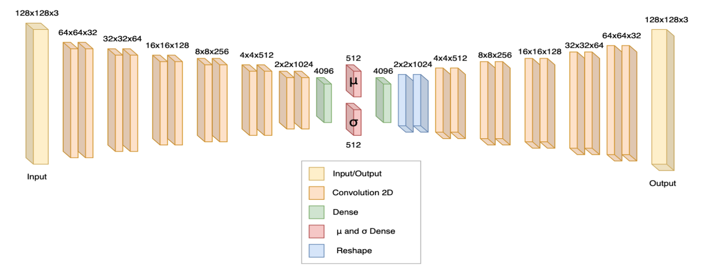
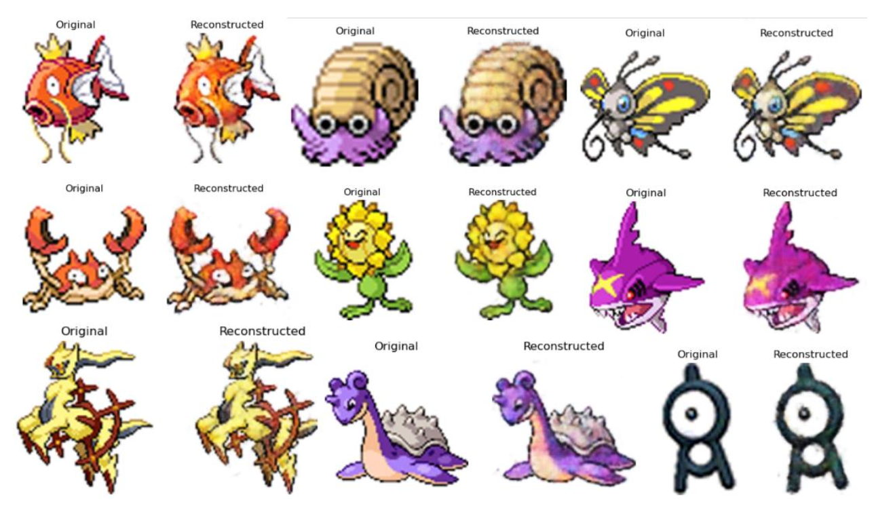
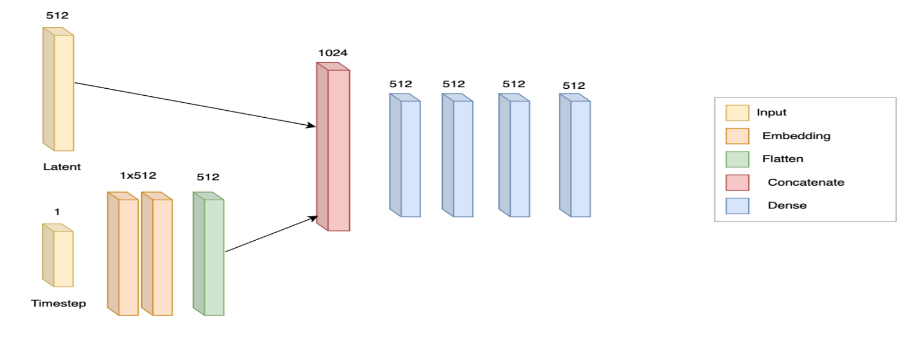
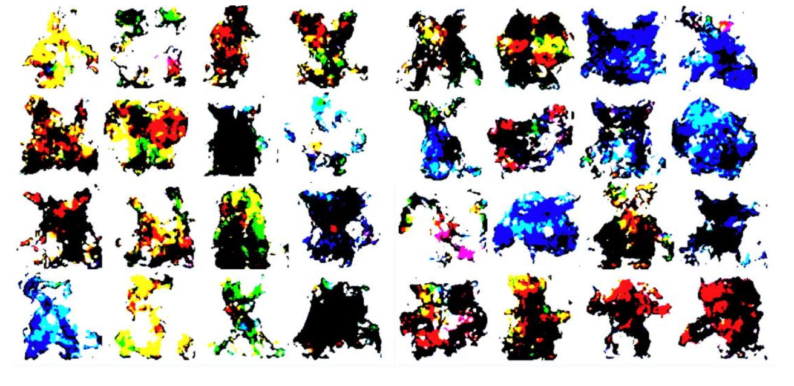
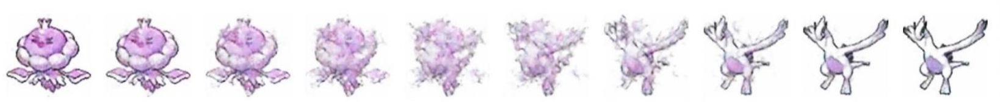

# PokeGenerator: Variational Autoencoder and Latent Diffusion for Sprite Generation

This deep learning project, developed as part of CSC 587 Final Project for Winter 2024, focused on generating Pokémon sprites through advanced machine learning techniques. Our team constructed a variational autoencoder and a latent diffusion reverse multilayer perceptron (MLP) model to innovate in the field of generative models.

## Project Members


- Braedan Kennedy (bkenne07@calpoly.edu)
- Luis David Garcia (lgarc120@calpoly.edu)
- Paul Jarski (pjarski@calpoly.edu)
- Briana Kuo (brkuo@calpoly.edu)

## Project Overview

Utilizing a rich dataset of Pokémon sprites, our goal was to generate original sprites that could contribute to extending open-source software such as Pokémon Showdown. The project encompassed dataset preprocessing, model implementation, and an evaluation phase that brought new insights into image generation challenges. A key feature of our project is the use of 512-dimensional latent vectors, offering a robust compressed representation of the original sprites.

## Contents

- `Variational Autoencoder Model`: Our VAE model is symmetrically designed with convolutional layers for encoding and decoding the Pokémon sprites with high fidelity.
- `Latent Diffusion Model`: Following the VAE, this model generates new character sprites by manipulating the latent space.
- `Evaluation Results`: Includes generated images and an interpolation of the VAE's embedding space.
- [CSC587-FinalProjectReport-PokeGenerator.pdf](./docs/CSC587-FinalProjectReport-PokeGenerator.pdf): A comprehensive report detailing our methodology, findings, and future directions.
-  [CSC587_PokemonGeneration_Presentation.pdf](./docs/CSC587_PokemonGeneration.pdf): A presentation overviewing the project highlights and visualizations.

## Variational Autoencoder Model

Our Variational Autoencoder (VAE) model features a symmetric architecture with convolutional layers designed to compress Pokémon sprite images into a 512-dimensional latent space. This process preserves the essence of the original images, enabling high-fidelity reconstruction.


<p align="center">
  
  <em>Figure 1: Variational Autoecnoder Model.</em>
</p>

Key aspects of the VAE model include:

- Encoding images into a latent representation with minimal information loss
- Utilization of the reparameterization trick for effective latent space sampling
- Reconstruction of images from latent vectors with high detail and variation

<p align="center">
  
  <em>Figure 2: Reconstruction Results of Variational Autoecnoder Model.</em>
</p>

## Latent Diffusion Model

Building upon the VAE, our Latent Diffusion Model introduces a novel approach to image generation. By manipulating the encoded latent space, the model progressively denoises and refines the generated sprites, resulting in unique and diverse Pokémon characters.

<p align="center">
  
  <em>Figure 3: Latent Diffusion Model.</em>
</p>

Features of the Latent Diffusion Model:

- Temporal transformation of latent vectors through an embedded series of timestamps
- A multi-layer perceptron (MLP) architecture to reconstruct the encoded information
- Production of coherent sprite images from structured latent vector refinement

## Evaluation Results

The evaluation phase involved assessing the quality of generated sprites and the effectiveness of latent space interpolation. Our findings highlight the model's capabilities and areas for future improvement.


<p align="center">
  
  <em>Figure 4: Generated sprites using the latent diffusion model.</em>
  
  <em>Figure 5: Interpolation of latent vectors within the VAE's embedding space.</em>
</p>

## Repository Structure

- `src/`: Source code for the variational autoencoder and latent diffusion model.
- `data/`: Preprocessed dataset used for training the models.
- `models/`: Trained model weights and architecture details.
- `results/`: Generated images and model performance metrics.
- `docs/`: Additional documentation and project report.

## Installation

``` bash
./setup.sh
```

## Environment Activation

``` bash
source venv/bin/activate
```

## Dataset Creation

`cd dataset` and see `README.md`

## Training Model

`cd model` and see `README.md`

## Acknowledgements

We express our gratitude to Professor Jonathan Ventura for his invaluable guidance and support throughout this project.

## License

This project is open-source and available under the MIT License. See the LICENSE file for more details.
